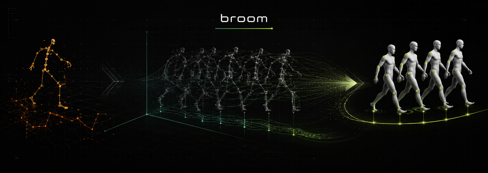

# BROOM: BVH Read, Optimize, Operate and Manipulate

<p align="center">
  
</p>

`broom` is a Python toolkit for loading, validating, editing, analyzing, interpolating, and retargeting human motion stored in the [Biovision Hierarchy (BVH)](https://en.wikipedia.org/wiki/Biovision_Hierarchy) format.

The library keeps the skeleton hierarchy, channel layout, timing metadata, and motion matrix together in a small `BVHDocument` data model. Most operations return a new document or array instead of mutating the source, so processing steps can be composed into reproducible motion pipelines.

> **Project status:** early development (`0.01`). The core workflows are usable.
>
> **License:** `broom` is available for permitted noncommercial use under the [PolyForm Noncommercial License 1.0.0](LICENSE). Commercial use requires a separate license from the copyright holder.

## Features

- Parse BVH hierarchies, channels, frame timing, motion values, and joint limits.
- Write complete motions or replace only selected channels while preserving the original hierarchy.
- Compute world-space joint positions and rotation matrices with forward kinematics.
- Trim, reverse, zero, fill, scale, and frame-rate-convert motion clips.
- Blend compatible BVH clips with quaternion SLERP for Euler rotation channels.
- Retarget motion between different BVH skeletons with automatic or explicit joint mapping.
- Export BVH motion to the combined 165D SMPL-X pose layout.
- Remove locomotion from root motion with a PCA-based in-place transform and optional foot locking.
- Calculate velocity, acceleration, jerk, energy, and reconstructed trajectories.
- Plot one or more motion clips with Matplotlib or explore them interactively in a notebook.
- Convert between rotation matrices, quaternions, dual quaternions, and continuous 6D rotations.
- Optionally refine retargeted motion with a PyTorch/L-BFGS inverse-kinematics solver.

## Requirements

- Python 3.10 or newer
- NumPy
- SciPy
- Matplotlib

These core dependencies are declared in `pyproject.toml` and are installed automatically with the package. PyTorch is optional and is required only for IK refinement.

The interactive notebook UI additionally needs `ipywidgets` and IPython:

```bash
python -m pip install ipywidgets ipython
```

## Installation

Clone the repository and install it from its root directory:

```bash
git clone https://github.com/AvaCapo/broom.git
cd broom
python -m pip install -e .
```

Install the optional PyTorch-based IK solver with:

```bash
python -m pip install -e ".[ik]"
```

To install every optional runtime feature:

```bash
python -m pip install -e ".[all]"
```

For development and tests:

```bash
python -m pip install -e ".[test]"
```

The editable install is useful while the API is under active development because local source changes are immediately available to Python.

## Quick start

```python
from broom.bvh import (
    compute_global_positions,
    load_bvh_document,
    write_bvh_with_motion_values,
)
from broom.bvh.ops import resample_fps, zero_origin

document = load_bvh_document("walk.bvh")

print(f"root: {document.root_name}")
print(f"frames: {document.frame_count}")
print(f"joints: {len(document.joints)}")
print(f"channels: {document.total_channels}")
print(f"frame time: {document.frame_time} s")
print(f"motion shape: {document.motion_values.shape}")

# World-space coordinates have shape (frames, joints, xyz).
positions = compute_global_positions(document)
print(positions.shape)

# Operations return new BVHDocument instances.
processed = zero_origin(
    document,
    axes=("Xposition", "Zposition"),
)
processed = resample_fps(processed, target_fps=30.0)

write_bvh_with_motion_values(
    document=processed,
    output_path="walk_30fps_centered.bvh",
    motion_values=processed.motion_values,
    precision=6,
)
```

## Core data model

### `BVHDocument`

`load_bvh_document()` returns an immutable metadata container with a mutable NumPy motion array:

| Attribute | Meaning |
| --- | --- |
| `path` | Path of the source BVH file. |
| `prefix_lines` | Original hierarchy and `MOTION` header lines. |
| `motion_values` | `float64` array with shape `(F, C)`: frames by channels. |
| `joints` | Tuple of `BVHJoint` objects in hierarchy order. |
| `total_channels` | Number of values expected in every motion row. |
| `root_name` | Name declared by the BVH `ROOT` node. |
| `root_channels` | Root channels in their declared file order. |
| `frame_time` | Seconds per frame, or `None` when unavailable. |
| `declared_frames` | Frame count written in the source header. |
| `frame_count` | Actual number of loaded motion rows. |
| `joint_names` | Joint names in hierarchy order. |
| `joint_index` | Mapping from joint name to its hierarchy index. |

Here and throughout this README:

- `F` means frame count;
- `J` means joint count;
- `C` means total BVH channel count.

### `BVHJoint`

Each joint stores:

- `name` and `parent` (`-1` identifies the root);
- the local rest-pose `offset`, shaped `(3,)`;
- the declared `channels` and their absolute `channel_start` offset;
- optional `dof`, `min_values`, and `max_values` metadata from a joint-limit file.

Only BVH `ROOT` and `JOINT` nodes become `BVHJoint` objects. `End Site` blocks remain part of the preserved hierarchy text but are not exposed as joints.

## Loading, inspecting, and writing BVH

### Load a document

```python
from broom.bvh import load_bvh_document

document = load_bvh_document("motion.bvh")

for index, joint in enumerate(document.joints):
    parent = None if joint.parent == -1 else document.joints[joint.parent].name
    print(index, joint.name, parent, joint.channels)
```

By default the loader resolves known joint limits using the packaged MuJoCo humanoid limit table. Disable that behavior or supply your own compatible JSON file when needed:

```python
without_limits = load_bvh_document(
    "motion.bvh",
    joint_limits_path=None,
)

custom_limits = load_bvh_document(
    "motion.bvh",
    joint_limits_path="joint_limits.json",
)
```

Pass `root_name` to validate the expected root exactly:

```python
document = load_bvh_document("motion.bvh", root_name="Hips")
```

### Replace motion values

Use `with_motion_values()` to make an in-memory document and a writer to serialize it:

```python
import numpy as np

from broom.bvh import write_bvh_with_motion_values
from broom.bvh.ops import with_motion_values

values = document.motion_values.copy()
values = np.nan_to_num(values, nan=0.0)

edited = with_motion_values(document, values)

write_bvh_with_motion_values(
    edited,
    "edited.bvh",
    edited.motion_values,
    precision=6,
)
```

The writer validates that the array is two-dimensional and has exactly `document.total_channels` columns. It creates parent directories, updates the `Frames:` header, and writes all numeric channels using the requested precision.

### Replace selected channels

```python
from broom.bvh import root_points, write_bvh_with_root_channels

xz = root_points(document, axes=("Xposition", "Zposition"))

write_bvh_with_root_channels(
    document=document,
    output_path="root_replaced.bvh",
    root_channel_values=xz,
    axes=("Xposition", "Zposition"),
    precision=6,
)
```

For arbitrary absolute channel indices, use `write_bvh_with_channel_values()`.

## Forward kinematics

```python
from broom.bvh import compute_global_positions, compute_global_transforms

positions = compute_global_positions(document)
positions, rotations = compute_global_transforms(document)

assert positions.shape == (document.frame_count, len(document.joints), 3)
assert rotations.shape == (document.frame_count, len(document.joints), 3, 3)
```

Forward kinematics:

- applies each joint offset relative to its parent;
- supports position channels on any joint;
- composes Euler rotations in the exact order declared by that joint's BVH channels;
- interprets BVH Euler channel values as degrees;
- replaces `NaN` channel values with zero during the calculation.

## Motion operations

The most common non-destructive edits live in `broom.bvh.ops`:

```python
from broom.bvh.ops import (
    fill_motion,
    resample_fps,
    reverse,
    scale_skeleton,
    slice_by_time,
    trim_frames,
    zero_origin,
)

clip = trim_frames(document, start_frame=60, end_frame=240)
clip_by_time = slice_by_time(document, start_seconds=2.0, end_seconds=6.0)

backwards = reverse(document, keep_root_start=True)
centered = zero_origin(document, axes=("Xposition", "Zposition"))
half_size = scale_skeleton(document, 0.5)
at_60_fps = resample_fps(document, 60.0)

# Repeat one pose for 90 frames. Omit pose to fill all channels with zero.
still = fill_motion(
    document,
    frame_count=90,
    pose=document.motion_values[0],
    frame_time=1.0 / 30.0,
)
```

Important behavior:

- `trim_frames()` uses normal Python slicing semantics: `end_frame` is exclusive.
- `slice_by_time()` floors the start and ceils the end so it does not shorten the requested interval.
- `reverse(..., keep_root_start=True)` offsets root position channels so the reversed clip begins at the original starting position.
- `scale_skeleton()` scales offsets and, by default, every position channel.
- `resample_fps()` linearly interpolates non-rotation channels and uses rotation-aware SLERP for joints with three Euler rotation channels.

Skeleton helpers such as `compute_rest_joint_positions()`, `estimate_skeleton_height()`, `estimate_hips_height()`, and `find_hips_joint_index()` are exported from the same module.

## Interpolating motion clips

The two input documents must have the same joint count, parent hierarchy, joint names, channel count, and per-joint channel layout.

```python
from broom.bvh import load_bvh_document, write_bvh_with_motion_values
from broom.bvh.interpolation import interpolate_documents

first = load_bvh_document("idle.bvh")
second = load_bvh_document("walk.bvh")

result = interpolate_documents(
    first_document=first,
    second_document=second,
    transition_frames=20,
    align_root_translation=True,
)

write_bvh_with_motion_values(
    document=result.document,
    output_path="idle_to_walk.bvh",
    motion_values=result.motion_values,
    precision=6,
)
```

The blend overlaps the last `transition_frames` of the first clip with the first `transition_frames` of the second. Root position channels are shifted to meet at the transition by default. Translation and other scalar channels use linear interpolation; complete three-channel Euler rotations use quaternion SLERP.

For file-based or multi-clip workflows, use the service API:

```python
from broom.bvh.interpolation import Interpolation

interpolator = Interpolation(
    min_frames=30,
    check_last_duplicates=True,
    root_name="Hips",
)

interpolator.process_batch(
    animation_list=["idle.bvh", "walk.bvh", "run.bvh"],
    transition_frames=20,
    output_path="sequence.bvh",
)
```

When `check_last_duplicates=True`, a trailing static section is removed before blending while retaining at least `min_frames` frames.

## BVH-to-BVH retargeting

The high-level file API loads a source motion and a target skeleton, builds a joint map, transfers rotations and root translation, and writes a new BVH:

```python
from broom.bvh.retargeting import retarget_bvh_file

result = retarget_bvh_file(
    source_path="source_walk.bvh",
    target_path="target_skeleton.bvh",
    output_path="target_walk.bvh",
    root_translation="scaled",
    rotation_correction="rest_pose",
    initial_pose="zero",
    floor_align=True,
    strict=False,
    precision=6,
)

print("root scale:", result.root_scale)
print("mapped joints:", result.joint_map)
print("unmapped source:", result.unmapped_source_joints)
print("unmapped target:", result.unmapped_target_joints)
```

### Joint mapping

Automatic mapping prefers, in order:

1. explicit entries;
2. exact normalized names;
3. namespace-tolerant matches such as `mixamorig:Hips` to `Hips`;
4. side-aware substring or token matches.

Each target joint can be used only once. For predictable production results, inspect the generated mapping or provide a source-to-target dictionary:

```python
joint_map = {
    "Hips": "pelvis",
    "LeftUpLeg": "left_hip",
    "RightUpLeg": "right_hip",
    "LeftLeg": "left_knee",
    "RightLeg": "right_knee",
}

result = retarget_bvh_file(
    "source.bvh",
    "target.bvh",
    "retargeted.bvh",
    joint_map=joint_map,
)
```

The same mapping can be stored as a JSON object and passed through `mapping_path`. Do not pass both `joint_map` and `mapping_path`.

### Retargeting options

| Option | Values | Behavior |
| --- | --- | --- |
| `root_translation` | `"scaled"`, `"copy"`, `"none"` | Scale by target/source rest-height ratio, copy unchanged, or omit source root movement. |
| `root_scale` | float or `None` | Override the automatically calculated scale. |
| `rotation_correction` | `"rest_pose"`, `"none"` | Correct differing rest-pose joint frames or only convert Euler order. |
| `initial_pose` | `"zero"`, `"first_frame"` | Initialize unmapped target channels with zeros or the target file's first pose. |
| `floor_align` | bool | Move root Y so first-frame foot/toe joints rest on the floor. |
| `strict` | bool | Reject any incomplete source or target mapping. |

`retarget_motion()` exposes the same operation for already loaded `BVHDocument` objects.

## BVH to SMPL-X

`retarget_bvh_to_smplx()` converts BVH global joint rotations into local axis-angle parameters in the combined 165D SMPL-X layout:

```text
3 global-orientation values + 63 body values + 9 jaw/eye values + 90 hand values = 165
```

The mapping must contain exactly 22 entries in SMPL-X body order. Each entry is `(target_name, source_name, target_parent_index)`, and every parent must appear before its children.

The following mapping is an example for a common Mixamo-style BVH. Adjust every source name to match `document.joint_names` exactly:

```python
import numpy as np

from broom.bvh import load_bvh_document
from broom.bvh.retargeting import retarget_bvh_to_smplx

document = load_bvh_document("source.bvh")

smplx_to_source = (
    ("pelvis",         "Hips",          -1),
    ("left_hip",       "LeftUpLeg",      0),
    ("right_hip",      "RightUpLeg",     0),
    ("spine1",         "Spine",          0),
    ("left_knee",      "LeftLeg",        1),
    ("right_knee",     "RightLeg",       2),
    ("spine2",         "Spine1",         3),
    ("left_ankle",     "LeftFoot",       4),
    ("right_ankle",    "RightFoot",      5),
    ("spine3",         "Spine2",         6),
    ("left_foot",      "LeftToeBase",    7),
    ("right_foot",     "RightToeBase",   8),
    ("neck",           "Neck",           9),
    ("left_collar",    "LeftShoulder",   9),
    ("right_collar",   "RightShoulder",  9),
    ("head",           "Head",          12),
    ("left_shoulder",  "LeftArm",       13),
    ("right_shoulder", "RightArm",      14),
    ("left_elbow",     "LeftForeArm",   16),
    ("right_elbow",    "RightForeArm",  17),
    ("left_wrist",     "LeftHand",      18),
    ("right_wrist",    "RightHand",     19),
)

source_joint_names = tuple(source for _, source, _ in smplx_to_source)

output = retarget_bvh_to_smplx(
    document,
    source_joint_names=source_joint_names,
    smplx_to_source=smplx_to_source,
    root_translation_scale=0.01,  # for example, centimetres to metres
    target_fps=30.0,
    gender="neutral",
)

np.savez("motion_smplx.npz", **output)
```

The returned dictionary has exactly these keys:

| Key | Shape / value | Description |
| --- | --- | --- |
| `poses` | `(F, 165)`, `float64` | Root, body, jaw, eyes, left hand, and right hand axis-angle pose. |
| `trans` | `(F, 3)`, `float32` | Root translation. |
| `gender` | scalar string array | Gender metadata supplied by the caller. |
| `mocap_framerate` | scalar `float64` | Effective output frame rate. |
| `betas` | `(16,)`, `float32` | SMPL-X shape coefficients; zeros by default. |

Optional inputs:

- `source_global_rotation_offsets`: one `(3, 3)` rotation matrix per entry in `source_joint_names`, used to re-express source global frames in the SMPL-X T-pose convention;
- `coordinate_transform`: a proper `(3, 3)` world-space rotation applied to the root orientation and translation;
- `hand_pose`: either one `(90,)` hand pose or per-frame `(F, 90)` values;
- `betas`: exactly 16 shape coefficients;
- `target_fps`: positive output rate; the BVH is resampled before conversion.

This function produces pose parameters and metadata. It does not load an SMPL-X body model or generate vertices, joints, or meshes.

## In-place conversion and foot locking

The PCA-based converter estimates the dominant travel direction from either root motion or a weighted body trajectory, removes its smoothed trend from root X/Z translation, and can compensate for planted feet.

```python
from broom.bvh.in_place import InPlaceConverter, InPlacePCAConfig

config = InPlacePCAConfig(
    root_name="Hips",
    source="body",              # "body" or "root"
    smooth_window=7,
    zero_origin=True,
    precision=6,
    foot_blend_frames=8,
    use_all_joints=False,
)

converter = InPlaceConverter.load(config)
result = converter.transform_file(
    input_path="walk.bvh",
    output_path="walk_in_place.bvh",
    foot_lock=True,
)

print("dominant direction:", result.dominant_direction)
print("explained variance ratio:", result.explained_ratio)
print("body joints used:", result.selected_joints)
```

The current converter assumes Y-up motion and operates on `Xposition` and `Zposition`. The default body source uses weighted hips, spine, head, leg, foot, toe, and shoulder joints. Names are matched case-insensitively and tolerate namespaces. Set `use_all_joints=True` for a uniform whole-skeleton trajectory.

With `foot_lock=True`, contacts are detected from foot/toe height and planar velocity. Thresholds are derived from skeleton height unless `foot_height_threshold` or `foot_velocity_threshold` is set explicitly.

For array-only processing, `transform_document()` returns corrected `(F, 2)` root X/Z values and a metadata dictionary without writing a file.

## Motion analysis

### World-space kinematics

```python
from broom.bvh import load_bvh_document
from broom.bvh.analysis import compute_world_kinematics, reconstruct

document = load_bvh_document("motion.bvh")

kinematics = compute_world_kinematics(
    document,
    method="savgol",  # "gradient", "five_point", or "savgol"
    sg_window=9,
    sg_polyorder=3,
    prefilter={
        "type": "lowpass_butter",
        "cutoff_hz": 6.0,
        "order": 2,
    },
)

print(kinematics.pos_w.shape)      # (F, J, 3)
print(kinematics.vel_w.shape)      # (F, J, 3)
print(kinematics.acc_w.shape)      # (F, J, 3)
print(kinematics.jerk.shape)       # (F, J, 3)
print(kinematics.speed_w.shape)    # (F, J)
print(kinematics.vel_energy.shape) # (J,)

reconstructed = reconstruct(
    kinematics,
    route="acc_to_pos",
    method="trapezoid",
    drift_correct=True,
)
```

Available reconstruction routes are `"acc_to_vel"`, `"vel_to_pos"`, and `"acc_to_pos"`. Integration supports trapezoidal, rectangular, and cumulative Simpson methods.

Use `compute_world_kinematics_many()` to compare several differentiation methods on the same clip.

### Plotting

```python
from broom.bvh.analysis import (
    PlotConfig,
    plot_joints_panel,
    plot_trajectory_planes,
)

joint_indices = [
    document.joint_index["Hips"],
    document.joint_index["LeftFoot"],
    document.joint_index["RightFoot"],
]

figure = plot_joints_panel(
    document,
    joint_indices,
    kinematics=kinematics,
    preset="locomotion",
    cfg=PlotConfig(title="Locomotion diagnostics"),
)
figure.savefig("kinematics.png", dpi=160)

trajectory_figure = plot_trajectory_planes(
    document,
    joint_indices,
    kinematics=kinematics,
    signals=("pos", "vel"),
    color_by_time=True,
)
trajectory_figure.savefig("trajectories.png", dpi=160)
```

Panel presets include `mag`, `pos`, `vel`, `acc`, `jerk`, `all_kinematics`, `all`, and `locomotion`. Multi-clip variants are available as `plot_joints_panel_multi()`, `plot_trajectory_planes_multi()`, and `plot_joint_debug_multi()`.

### Notebook UI

After installing the notebook dependencies:

```python
from broom.bvh.analysis import MotionCompareUI, MotionPlotUI

MotionPlotUI(document).show()

# Compare several compatible or unrelated clips by joint index.
MotionCompareUI(
    documents=(first_document, second_document),
    clip_labels=("before", "after"),
).show()
```

## Rotation representations

```python
from broom.bvh.rotations import dual_quat, ortho6d, quat

rotation_matrices = quat.to_matrix(quaternions)
quaternions = quat.from_matrix(rotation_matrices)
continuous_6d = ortho6d.from_matrix(rotation_matrices)
dual_quaternions = dual_quat.from_rotation_translation(
    quaternions,
    translations,
)
```

Conventions:

- quaternions use scalar-first order `[w, x, y, z]`;
- Euler inputs to `broom.bvh.rotations.quat` use radians;
- BVH channel angles and high-level BVH interpolation/retargeting APIs use degrees;
- matrices use trailing shape `(..., 3, 3)`;
- continuous 6D rotations use trailing shape `(..., 3, 2)`;
- dual quaternions use `[w_r, x_r, y_r, z_r, w_d, x_d, y_d, z_d]`.

The quaternion module includes matrix/Euler/angle-axis conversion, multiplication, normalization, inverse, vector rotation, unrolling, shortest-path SLERP, and from-to rotations.

## Joint limits and IK refinement

The default joint-limit JSON is loaded into `BVHJoint` metadata when names match known aliases. A lower-level PyTorch solver can refine a forward-kinematics retarget by minimizing global position errors while penalizing joint-limit violations and deviation from the seed motion:

```bash
python -m pip install -e ".[ik]"
```

```python
from broom.bvh.retargeting.ik_solver import (
    optimize_retargeted_motion_with_ik,
)

refined_values = optimize_retargeted_motion_with_ik(
    source_document=source_document,
    target_document=target_document,
    target_motion=retarget_result.motion_values,
    source_to_target=retarget_result.joint_map,
    root_scale=retarget_result.root_scale,
    iterations=20,
    device="cpu",
)
```

The IK API currently lives in the implementation module rather than the package-level retargeting exports. Treat it as an advanced API that may change more quickly than `retarget_motion()`.

## Interactive rendering

`broom.bvh.render` provides optional Meshcat and Viser viewers. Their
dependencies are not declared in `pyproject.toml` yet. See
[docs/rendering.md](docs/rendering.md) for the viewer API, tested versions,
and links to upstream installation instructions.

## Public API overview

| Module | Main exports |
| --- | --- |
| `broom.bvh` | `BVHDocument`, `BVHJoint`, loading/writing, channel selection, joint limits, forward kinematics. |
| `broom.bvh.ops` | Frame/time slicing, reversing, filling, origin removal, resampling, skeleton scaling and measurements. |
| `broom.bvh.interpolation` | Document and array interpolation, Euler blending, static-tail detection, `Interpolation`. |
| `broom.bvh.retargeting` | Joint mapping, BVH-to-BVH retargeting, root transfer, rotation transfer, SMPL-X conversion. |
| `broom.bvh.in_place` | PCA-based in-place conversion and configuration. |
| `broom.bvh.analysis` | Derivatives, integration, filtering, world kinematics, reconstruction, plotting, notebook UI. |
| `broom.bvh.rotations` | Quaternion, dual-quaternion, and continuous-6D conversion utilities. |

## Coordinate and timing assumptions

- BVH channel order is authoritative; the library does not force a global Euler order.
- Most locomotion-specific helpers assume X/Z is the floor plane and Y is vertical.
- `frame_time` is measured in seconds per frame; FPS is `1 / frame_time`.
- Duration between the first and last samples is `(frame_count - 1) * frame_time`.
- Root-channel helpers use channel names such as `Xposition`, `Yposition`, and `Zposition`, not fixed column numbers.
- Joint-name matching can tolerate namespaces in helper and retargeting APIs, but `document.joint_index` itself uses exact names.
- The loader records both `declared_frames` and actual `frame_count`; consumers should normally use `frame_count`.

## Current constraints

- Interpolation is for identical skeleton/channel layouts. Use retargeting first when skeletons differ.
- Rotation-aware interpolation and BVH-to-BVH rotation transfer operate on joints with exactly three rotation channels.
- `scale_skeleton()` updates parsed offsets for in-memory processing, but the current writer preserves the original hierarchy text and does not rewrite BVH `OFFSET` lines.
- Automatic joint mapping is heuristic. Inspect it before using the result in a production pipeline.
- In-place conversion currently targets X/Z root travel on a Y-up skeleton.
- SMPL-X export requires the caller to supply the exact 22-joint source mapping and any required rest-frame corrections.
- The plotting API uses Matplotlib. Interactive notebook widgets are not installed by the default package dependencies.
- The `filtering` and `render` packages are currently placeholders; filtering for analysis is available under `broom.bvh.analysis`.

## License

`broom` is licensed under the [PolyForm Noncommercial License 1.0.0](LICENSE).

You may use, modify, and distribute the software for purposes permitted by that license. Commercial use is not granted by the public license and requires a separate license from the copyright holder.

Because it restricts commercial use, `broom` is source-available software rather than Open Source Initiative (OSI)-approved open-source software. See the [`LICENSE`](LICENSE) file for the complete terms.
